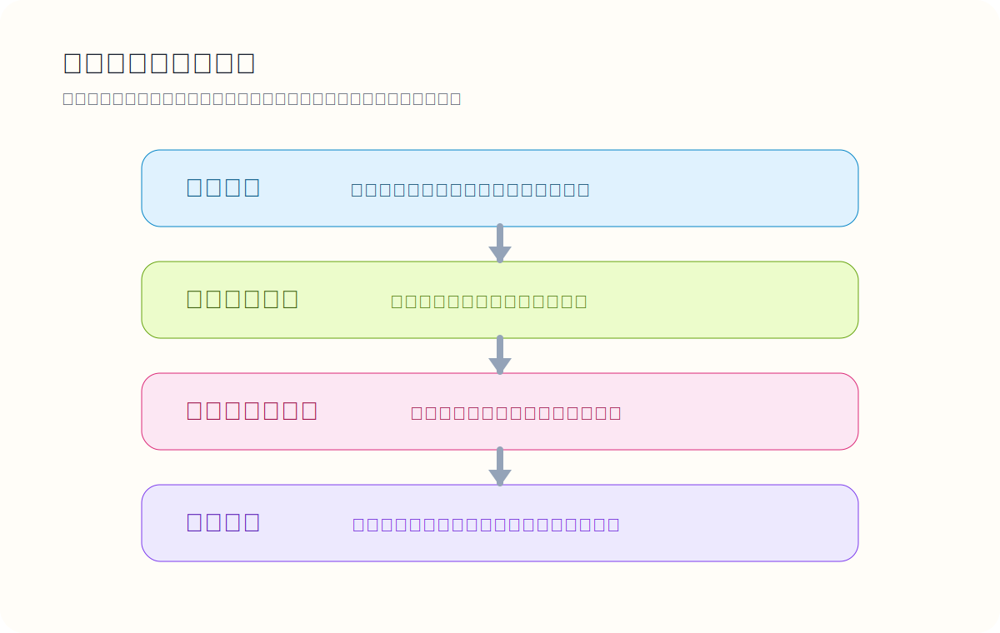
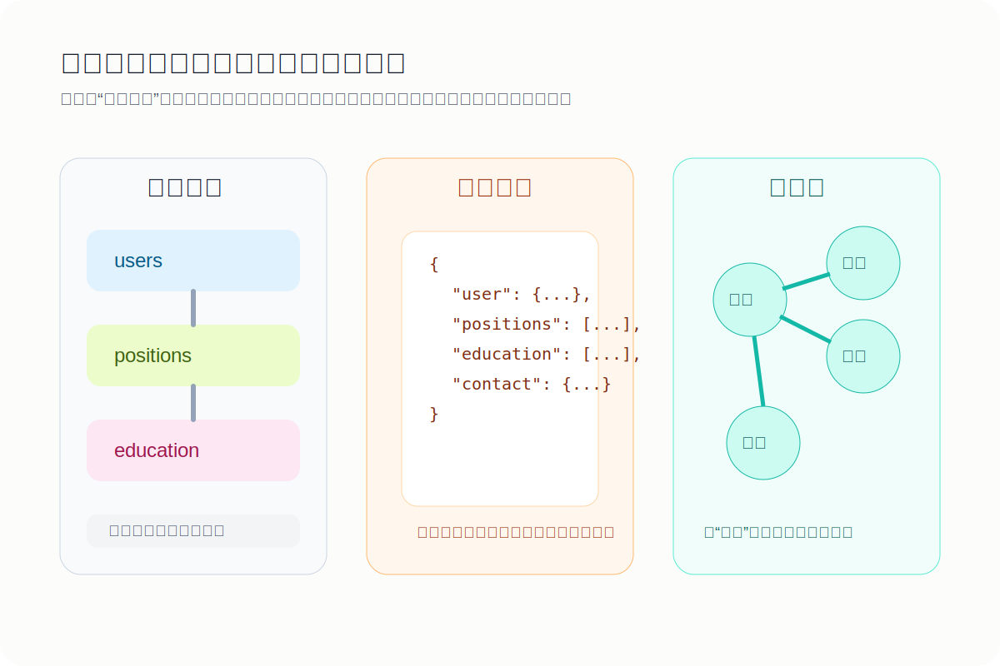
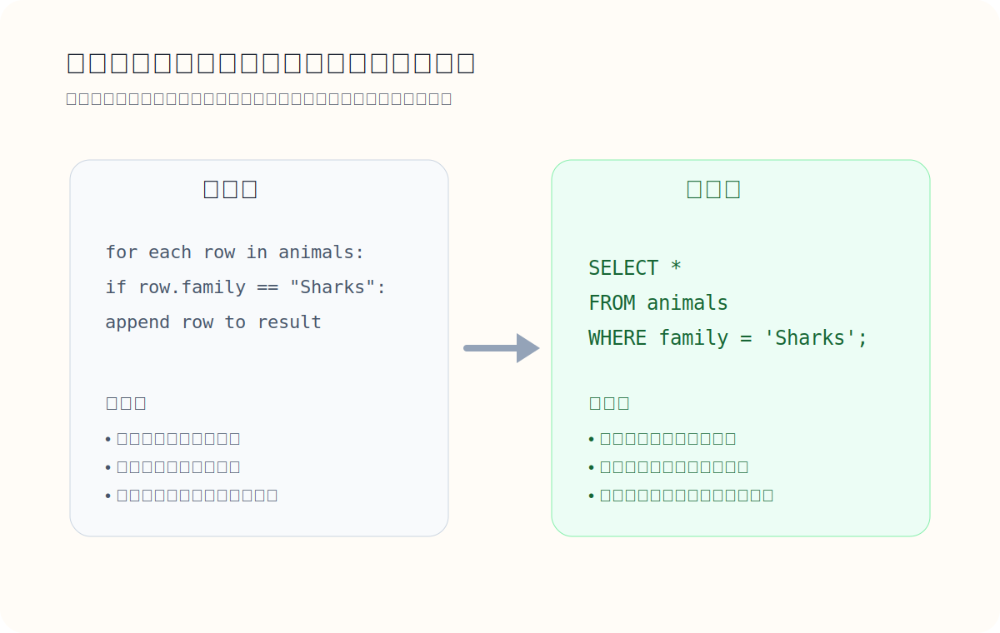
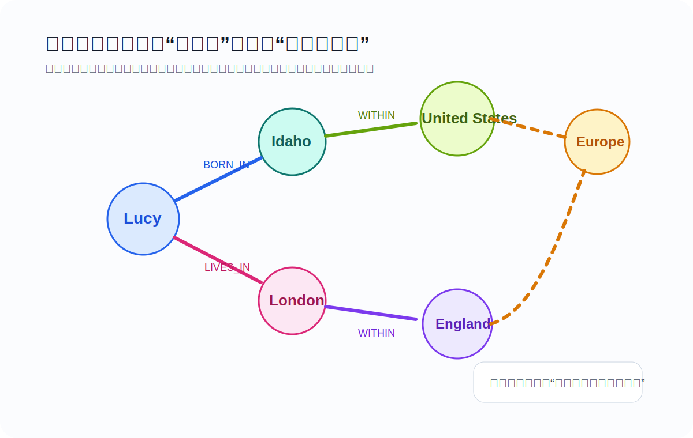

> 语言的边界，就是思想的边界。

这句话用在数据库世界里，几乎同样成立。一个团队选择什么样的数据模型，往往不只是决定“数据放哪儿”，而是在更深层次上决定：问题会被如何拆解、关联关系会被如何表达、系统未来会以何种方式扩展。

很多数据库选型讨论，一上来就比性能、比吞吐、比延迟。但在真正影响软件设计的因素里，数据模型常常比存储引擎更靠前。因为应用开发者首先接触到的，并不是磁盘页、LSM Tree 或 B-Tree，而是表、文档、边、节点，以及围绕它们展开的查询语言。

这篇文章想讨论四个问题：

1. 为什么数据模型是软件设计里最深层的抽象之一？
2. 关系模型、文档模型、图模型分别擅长什么？
3. 为什么“对象关系不匹配”会反复出现？
4. 为什么声明式查询语言至今仍然比命令式访问方式更重要？

## 数据模型，其实是一层一层叠出来的

软件系统中的数据，很少是“直接”存进数据库的。更常见的情况是：每一层都在用自己的抽象，去屏蔽下一层的复杂度。



一个典型应用里，至少存在下面几层：

1. 业务层看到的是用户、订单、内容、组织、支付、消息这些现实对象。
2. 存储层会把这些对象映射到表、JSON 文档、键值对或图结构。
3. 数据库内部再把这些结构转换成索引、页、日志、内存对象和磁盘字节。
4. 更底层则由硬件和网络把字节表示成电流、磁信号或光信号。

这套分层的价值在于协作。应用开发者不需要理解页分裂就能写 SQL，数据库工程师也不需要理解你的促销活动规则就能改进查询优化器。抽象让复杂系统得以分工。

但抽象不是中性的。你选择了什么样的数据模型，也就选择了什么样的问题表达方式。有些模型让某些查询非常自然，有些模型则会把同样的需求变成别扭、昂贵，甚至难以维护的实现。

## 关系模型为什么统治了几十年

关系模型最重要的贡献，不只是“表格长得整齐”，而是它把数据访问从“沿着预定义路径导航”变成了“声明你要什么结果”。

关系模型里，数据被组织成表，表由行构成，行由列组成。它看上去朴素，但有两个非常强的工程优势：

- **结构清晰**：实体、属性、约束和关系都可以明确描述。
- **连接能力强**：多对一、多对多关系都能用统一方式表达。

对于业务系统来说，这种能力极其关键。订单关联用户，用户属于组织，商品属于分类，角色关联权限，权限又作用于资源。只要系统里存在大量关联关系，关系模型就会显得非常自然。

更重要的是，SQL 让开发者从“怎么一步一步拿到数据”中解放出来。你描述结果条件，优化器负责决定索引、连接顺序和执行计划。这种抽象层带来的长期收益，远超语法本身。

## NoSQL 真正推动的，不只是“反 SQL”

NoSQL 的兴起，表面上像是对关系模型的反叛，实质上更像是应用场景变化后的再分工。

推动它兴起的几个现实原因很直接：

- 某些场景需要更高的写入吞吐和更容易横向扩展的架构
- 开发者希望更灵活地存放异构数据
- 某些查询模式并不适合强连接、强规范化的表结构
- Web 应用和 API 越来越天然地使用 JSON 作为数据交换格式

因此，NoSQL 从来不是单一技术路线，而是一组带有不同取舍的系统集合。把它理解成“不是只有 SQL”会更贴切。真正值得关心的从来都不是标签，而是数据关系的形态与查询需求的性质。

## 对象关系不匹配，为什么总绕不过去

现代应用多数用面向对象语言开发，业务模型在代码里表现为对象、结构体、枚举和集合；而关系数据库提供的是表、行、列、外键和连接。两套模型都很成熟，但它们的形状并不一致。

最典型的例子是“用户简历”这种数据：

- 用户姓名、头像、简介通常是单值字段
- 工作经历、教育经历、联系方式往往是一对多集合
- 城市、行业、学校、公司又可能指向标准化实体

如果完全按关系模型表达，这类数据通常会被拆成多张表，通过外键关联；如果按文档模型表达，它又天然像一个嵌套 JSON 对象。



ORM 能减轻部分样板代码，但无法真正消除这种不匹配。因为问题不只在“映射麻烦”，而在于两边的抽象重点不同：

- 面向对象模型强调封装后的聚合对象
- 关系模型强调可连接、可约束、可规范化的数据集合

所以，ORM 更像是缓冲层，而不是终极解决方案。

## 文档模型什么时候更合适

如果数据天然呈现为树状结构，而且通常会整体读取，那么文档模型通常更顺手。

一个 JSON 文档适合承载这样的数据：

- 一个对象内部有多个嵌套列表
- 子对象大多依附于父对象存在
- 查询经常是“拿整个对象出来渲染”
- 文档之间的关系相对较弱

例如用户档案、商品详情页配置、内容发布元数据、事件日志上下文，往往都很适合文档模型。你不必为了几个一对多字段把数据拆成五六张表，再让应用层把它们重新组装回去。

文档模型的几个现实优势包括：

- **局部性更好**：相关信息通常在一次读取里就能拿到。
- **结构更贴近 API**：尤其适合直接输出 JSON 的系统。
- **模式更灵活**：同一个集合里允许出现字段差异更大的记录。

但这种灵活并非没有代价。

### 读时模式，并不等于没有模式

很多人把文档数据库称为“无模式”，这并不准确。更准确地说，它们常常采用读时模式：数据库本身不强制所有记录长得完全一致，但应用代码在读取时，仍然隐含地假设某种结构存在。

这在数据格式演进时很方便。比如你原来只有一个 `name` 字段，现在要拆成 `first_name` 和 `last_name`，就可以让新文档按新格式写入，旧文档在读取时兼容处理。

这种模式对异构数据很友好，例如：

- 同一集合里存多种类型对象
- 数据结构来自外部系统，无法完全控制
- 新字段经常增删，且不适合频繁做强约束迁移

但如果所有记录本质上结构稳定、约束明确，那么写时模式反而是优势。它能更早暴露错误，并让团队共享一致的数据契约。

### 文档模型最大的短板，是关联关系

文档模型很擅长一对多的树状结构，但一旦进入多对一、多对多关系密集区域，问题就开始暴露。

假设简历里的“公司”和“学校”不再只是字符串，而是平台上的实体页面；假设“推荐人”也要关联到另一个用户，并随着其头像变化自动更新展示；假设行业和地区需要支持标准化、国际化与搜索归类。这时你就会发现：

- 文档内嵌已经不够用
- 引用越来越多
- 应用层要承担更多“手动连接”和一致性维护工作

如果连接能力薄弱，复杂性就不会消失，只会从数据库转移到应用代码里。

## 关系模型与文档模型，不是二选一的宗教战争

把关系数据库和文档数据库放在一起比较时，一个常见误区是非此即彼。实际上，更合理的判断标准是：你的数据关系，到底更像树，还是更像网？

可以用一个经验法则来判断：

- 如果数据主要是聚合读取的一对多结构，文档模型通常更自然。
- 如果系统有大量共享实体、交叉引用和复杂连接，关系模型通常更稳妥。

很多真实系统最后走向的是混合方案：

- 核心交易数据放关系数据库
- 聚合展示数据放文档或缓存层
- 搜索索引维护面向检索的冗余视图

这并不是“妥协”，而是承认不同模型擅长解决不同问题。

## 声明式查询语言，为什么仍然是数据库世界的关键发明

SQL 最大的价值，并不只是语法可读，而是它代表了一种声明式思维。

命令式写法会告诉系统：先遍历什么，再判断什么，再把结果放到哪里。声明式写法则是直接说：我要满足这些条件的数据。至于如何执行，由查询优化器决定。

例如，找出所有 `family = 'Sharks'` 的记录，命令式写法通常是一个循环加条件判断；而 SQL 可以直接表达为：

```sql
SELECT *
FROM animals
WHERE family = 'Sharks';
```

这种差异的真正价值在于两点：

- **优化空间更大**：数据库可以自由选择索引、并行化、连接顺序。
- **查询更稳定**：底层存储布局变化，不必牵连应用代码一起改写。



声明式语言的优势并不局限于数据库。CSS 之于 DOM，和 SQL 之于数据集，本质上是同一种思想：你描述目标状态，而不是手工操纵每一个步骤。

## MapReduce：介于查询语言和编程框架之间

NoSQL 世界里，一个常见尝试是把高级查询退回到“用代码表达逻辑”。MapReduce 就是典型代表。

它的思路很强大：

- `map` 负责把输入映射成键值对
- `reduce` 负责按键聚合结果

这对批处理和分布式聚合很有价值，也适合大规模并行执行。但它始终更接近编程模型，而不是高层查询语言。开发者要同时思考映射逻辑、聚合逻辑和中间结果形态，表达成本明显高于一条声明式查询。

也正因如此，很多 NoSQL 系统后来又逐步补回了更高层的声明式能力，例如 MongoDB 的聚合管道。你会发现，系统绕了一圈，最后常常又走回“让用户描述结果，让系统决定执行方式”这条路上。

## 当关系比实体更重要时，图模型会变得自然

如果说文档模型适合树，关系模型适合表，那么图模型擅长处理的就是“网”。

在图模型里，核心元素不是表或文档，而是：

- 顶点：人、地点、组织、事件、页面
- 边：认识、位于、引用、关注、购买、推荐

当你的问题不是“这个对象有哪些字段”，而是“这个对象和其他对象如何连接”时，图模型就会变得非常自然。

典型场景包括：

- 社交关系网络
- 风控与反欺诈关系链路
- 知识图谱
- 组织、权限与资源依赖图
- 路径搜索、推荐、影响传播分析



图模型的价值不只在“能存边”，而在于它允许你把关系本身作为一等公民来看待。对于高度互联的数据，这种表达会比表连接或文档嵌套更接近问题本身。

## 图查询语言解决的，是“路径不确定”的问题

关系数据库当然也能表示图。你完全可以用 `vertices` 表和 `edges` 表来存节点与边。但一旦查询需要“沿着若干层关系往前走，直到找到符合条件的节点”，关系模型的表达就会迅速变得笨重。

图查询语言如 Cypher、SPARQL、Datalog 的优势，恰恰在于它们把“模式匹配”和“路径遍历”提升为一等表达能力。

例如，“找出所有出生在美国、现在住在欧洲的人”，在图模型里本质上是一个路径模式匹配问题：

- 人连接到出生地
- 出生地继续向上归属到国家
- 人连接到现居地
- 现居地继续向上归属到洲

如果使用 SQL，也并非不能写，但通常要借助递归公用表表达式，写法更长、意图也更不直观。这里不是 SQL 不够强，而是它为“表和集合”设计，不是为“关系路径”设计。

这也是一个反复出现的经验：**能够表达，不等于表达自然。**

## 那到底该怎么选模型？

如果一定要给一个简化版判断框架，我会这样分：

### 适合优先考虑关系模型的场景

- 核心业务数据有强约束和事务一致性要求
- 多对一、多对多关系很多
- 查询模式复杂且经常依赖连接
- 团队希望模式清晰、数据契约稳定

### 适合优先考虑文档模型的场景

- 数据天然是聚合对象，通常整体读取
- 不同记录之间结构差异较大
- 外部输入格式变化快
- 关系较弱，连接需求有限

### 适合优先考虑图模型的场景

- 关系本身比单个实体属性更重要
- 需要多跳遍历、路径搜索、影响传播分析
- 数据连接复杂且持续演化
- 查询目标经常是“找到满足某种关系模式的对象”

真正成熟的系统设计，往往不是押注一个万能模型，而是承认模型之间的边界：用最适合的抽象去承接最适合的问题。

## 写在最后

数据库领域最容易被忽略的一点是：数据模型不仅决定你如何存数据，也决定你如何理解问题。

关系模型教会我们用集合、约束和连接表达业务世界；文档模型提醒我们有些数据天生就是聚合对象；图模型则进一步说明，某些问题的核心不是实体本身，而是实体之间的连接方式。至于查询语言，SQL、Cypher、SPARQL 这些看似只是“语法”的东西，实则在定义人和系统如何分工。

所以，真正好的选型问题通常不是“哪个数据库更快”，而是“我的问题更像表、像树，还是像网”。当这个问题回答清楚了，很多技术争论本身就会自动收敛。
