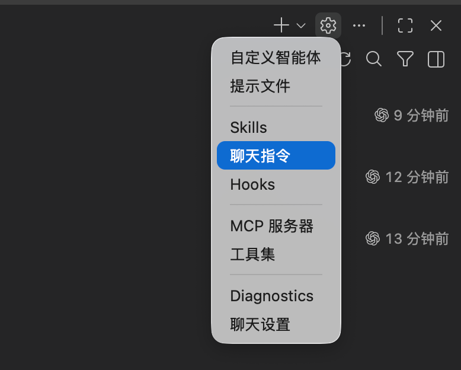
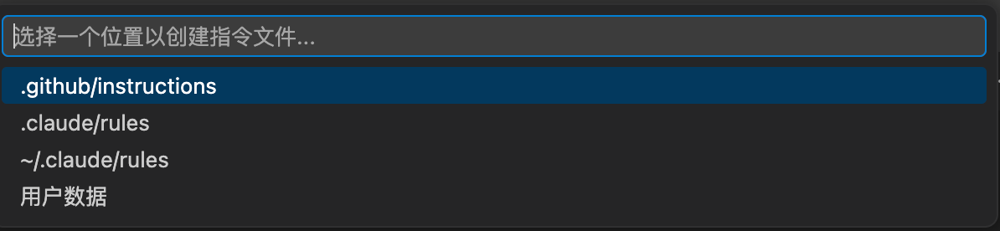
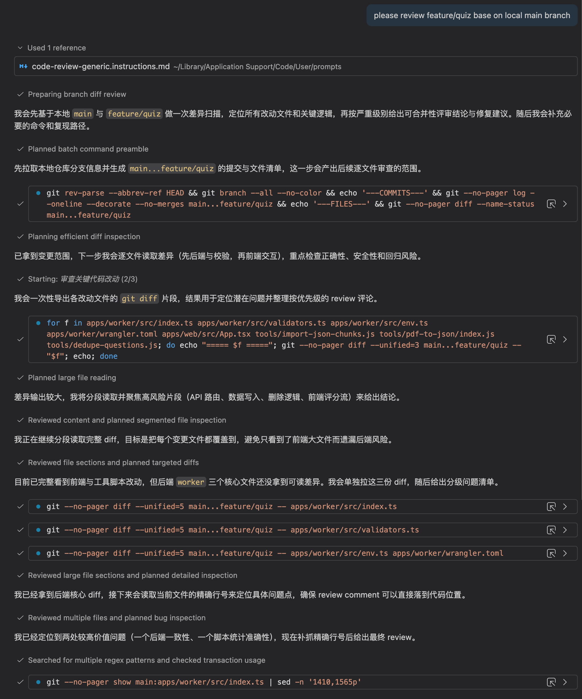
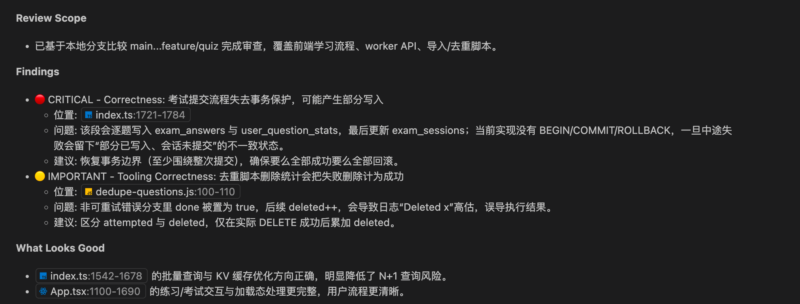

很多同学在用 Copilot Chat 做审查时，最大问题不是“不会提问”，而是**每次提示词不一致**，导致输出质量忽高忽低。

这篇文章给你一套可落地方案：把 Code Review 规则固化为 **聊天指令（Chat Instructions）**，让 Copilot 在每次审查时都按统一标准输出。

---

## 为什么要用聊天指令做 Code Review？

把审查规则写进聊天指令后，你会得到三个直接收益：

1. **标准统一**：所有审查都按同一优先级（安全、正确性、测试、性能）输出。
2. **上下文稳定**：不用每次手动粘贴长 prompt。
3. **团队可复用**：可以放在仓库级共享，也可以放在用户级全局复用。

---

## 第一步：在 VS Code 添加聊天指令（图1）

在 Copilot Chat 面板右上角菜单中选择“聊天指令（Chat Instructions）”，进入新建流程。



---

## 第二步：选择指令存放位置（图2）

创建时会让你选择保存位置，通常有两类：

- **仓库级**：`.github/instructions`（推荐团队协作项目）
- **用户级**：用户数据目录（推荐个人全局偏好）

你可以按使用场景自由选择。



---

## 一键安装我的中文模板

我已经把中文模板放到仓库：

- `.github/instructions/code-review-generic-zh.instructions.md`

一键安装链接（已替换为当前仓库地址）：

- [点击安装聊天指令](https://aka.ms/awesome-copilot/install/instructions?url=vscode%3Achat-instructions%2Finstall%3Furl%3Dhttps%253A%252F%252Fraw.githubusercontent.com%252FKahen%252Fdev-man-blog%252Fmain%252F.github%252Finstructions%252Fcode-review-generic-zh.instructions.md)

---

## 中文模板（可直接复制）

> 完整版本请以仓库文件为准：`.github/instructions/code-review-generic-zh.instructions.md`

```yaml
---
description: '适用于 GitHub Copilot 的通用代码审查指令模板，可按项目自定义'
applyTo: '**'
excludeAgent: ["coding-agent"]
---
```

```markdown
# 通用代码审查指令（可按项目自定义）

执行代码审查时，请使用中文输出，并按以下优先级给出结论：

1. 🔴 CRITICAL（阻止合并）：安全、正确性、破坏性变更、数据丢失
2. 🟡 IMPORTANT（需要讨论）：代码质量、测试覆盖、性能、架构偏差
3. 🟢 SUGGESTION（改进建议）：可读性、优化、最佳实践、文档补充

评论需要包含：
- 问题描述
- 为什么重要（影响）
- 修复建议（可附代码）
- 参考资料（可选）

同时系统性检查：
- 代码质量：命名、SRP、DRY、复杂度、错误处理
- 安全性：输入校验、鉴权、注入、密钥管理、依赖漏洞
- 测试：关键路径覆盖、边界场景、断言质量、测试独立性
- 性能：N+1、算法复杂度、缓存、资源释放、分页
- 架构：关注点分离、依赖方向、耦合与内聚、模式一致性
- 文档：公共 API、复杂逻辑说明、README/破坏性变更更新
```

---

## 效果演示：如何触发自动 Code Review（图3 / 图4）

你可以用两种方式触发高质量审查：

### 方式 A：基于 commit hash 审查

例如在聊天中输入：

```text
please review commit <your_commit_hash>
```

### 方式 B：基于分支差异审查（推荐）

例如：

```text
please review feature/quiz based on local main branch
```

当你在结果里看到 **Used 1 reference**，通常表示 Copilot 已读取并应用了安装的聊天指令。





---

## 我在实际使用中的建议

1. **先定规则再审查**：先沉淀好指令模板，再让团队统一使用。
2. **把模板版本化**：放仓库并走 PR，保持规则可审计。
3. **审查结果分层消费**：先处理 CRITICAL，再处理 IMPORTANT。
4. **让 AI 做“第一轮审查”**：人类 reviewer 重点看业务与架构权衡。

这样用下来，Copilot 不只是“问答助手”，而是可复用的审查流程组件。
