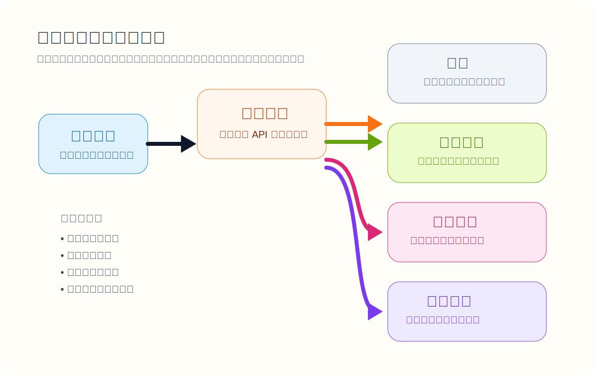
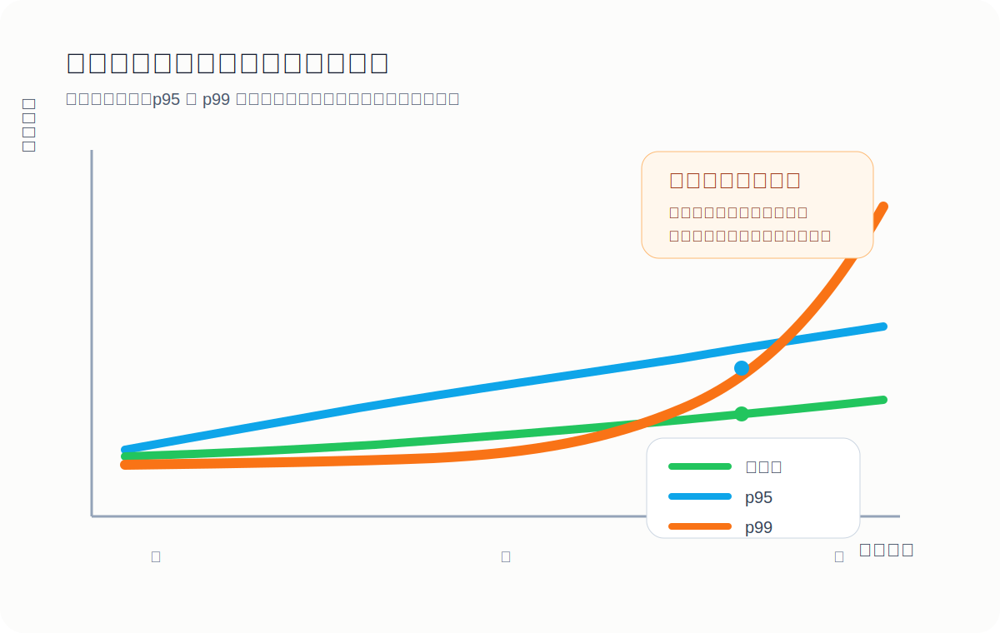
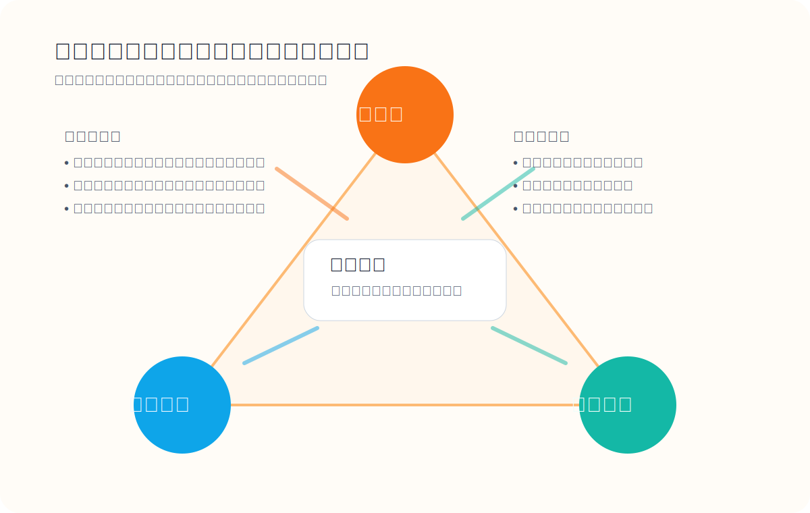

> 互联网之所以显得像空气和海洋一样“理所当然”，恰恰是因为背后那套工程系统长期稳定得近乎隐形。

今天的大多数应用，瓶颈并不在 CPU 算力，而在数据本身：数据量更大、结构更复杂、变化更频繁，系统还要承受不均匀的流量和持续演进的业务需求。也正因为如此，现代应用更像是在搭积木：数据库负责保存事实，缓存负责缩短等待，搜索索引负责找东西，消息队列负责把异步流程串起来。

问题在于，把这些组件拼在一起之后，你不只是“在写业务代码”，而是在设计一套新的数据系统。系统一旦出问题，用户不会关心故障发生在数据库、缓存还是消息总线上，他们只会看到页面慢了、结果错了、服务挂了。

这篇文章试着回答三个比“选哪种数据库”更基础的问题：

1. 什么样的系统才算可靠？
2. 面对增长，系统怎样才算可扩展？
3. 一个系统怎样才算容易维护，而不是几年后变成没人想碰的遗留包袱？

## 为什么数据系统不能只看单点工具

我们习惯把数据库、缓存、搜索、消息队列分成不同类别，但在真实系统里，它们的边界越来越模糊。Redis 可以既当缓存也当轻量消息通道，Kafka 既像消息系统，也带有持久化日志的数据库气质。

更关键的是，单个工具通常解决不了完整问题。一个典型的内容平台，往往至少会把职责拆成下面几部分：

- 主数据库保存权威数据
- 缓存承接高频读取
- 搜索索引提供全文检索和筛选
- 消息队列处理异步任务与解耦

一旦你选择这种组合式架构，就必须面对一个额外问题：这些组件之间如何保持一致？

举个常见场景：用户修改文章标题后，数据库里的记录已经更新，但缓存里还是旧值，搜索索引也还没刷新。此时同一个用户在不同入口看到的内容可能互相矛盾。这不是某个单点组件的 bug，而是整个数据系统设计的问题。

所以，比“某个中间件快不快”更重要的，是你是否清楚系统在以下三件事上的目标：

- 出故障时，能不能继续正确工作
- 负载增长时，能不能稳住性能
- 需求变化时，团队能不能低风险地改动它

## 可靠性：不是不出错，而是出错了还能顶住

很多人把“可靠”理解成“永远不坏”，这不现实。更准确的说法是：**系统在硬件故障、软件缺陷和人为失误出现时，仍然能维持正确性和可接受的性能。**

### 三类最常见的故障来源

#### 1. 硬件故障

磁盘损坏、内存异常、机器断电、交换机故障，这些都属于典型硬件问题。单台机器上看它们像小概率事件，但在成百上千台机器组成的集群里，故障几乎是日常而不是例外。

工程上最直接的应对方式是冗余：

- 磁盘做 RAID
- 服务多副本部署
- 电源和网络链路做冗余
- 数据做多机或多可用区复制

这套思路的核心不是“阻止硬件坏掉”，而是“让单点坏掉时服务还能继续跑”。

#### 2. 软件故障

比硬件更麻烦的是系统性软件错误。它们不是随机落在某一台机器上的，而是可能同时影响很多节点，例如：

- 某个特殊输入触发所有实例崩溃
- 某个慢查询把线程池拖死
- 下游服务变慢，导致调用方出现级联超时
- 资源泄漏把 CPU、内存或磁盘打满

这类问题的危险在于“相关性”。硬件故障往往彼此独立，软件缺陷却可能在整个集群里一起爆发。

因此，可靠性设计不能只靠高可用部署，还要依赖工程纪律：

- 隔离故障域，避免一个组件拖垮全局
- 通过限流、熔断、超时控制阻止级联失败
- 做运行时监控与自检，而不是只靠上线前测试
- 定期演练故障场景，验证容错链路真的能工作

有时候，主动制造小故障反而能增强系统信心。混沌工程的出发点正是如此：你越是依赖容错机制，就越应该定期证明它没有失效。

#### 3. 人为错误

生产事故里，人为失误常常比想象中更常见。错误配置、误删数据、错误发布、证书更新失败，这些都足以让一个本来设计不错的系统瞬间失稳。

降低人为风险的做法通常比“责怪人”更有效：

- 提供可回滚的配置和发布机制
- 用沙箱环境验证高风险操作
- 将危险操作做成显式、可审计、可自动化的流程
- 把监控和告警设计成“能帮助定位原因”，而不是只会报红

### 可靠性的关键，不只是可用，更是正确

有些系统“还能响应请求”，但返回的是错数据，这种情况并不能叫可靠。可靠性的底线至少包括：

- 功能行为符合用户预期
- 数据完整且一致
- 在预期负载下性能可接受
- 能抵御未授权访问和滥用

一个经常被忽略的事实是：**错误结果往往比明确报错更危险。** 报错还能触发回退和人工介入，悄悄写错数据通常会把问题带到更后面。

## 可扩展性：不是一句“能扩容”就算数

系统今天扛得住，不代表半年后还扛得住。所谓可扩展，核心不是“可以加机器”这么抽象，而是：**当负载按某种方式增长时，你知道瓶颈在哪，以及该加什么资源来维持目标性能。**

### 先定义负载，再讨论扩展

负载不是单一数字。不同系统关心的负载参数完全不同，例如：

- Web 服务看每秒请求数
- 数据库看读写比例与热点分布
- 聊天系统看同时在线人数
- 搜索系统看查询复杂度与索引刷新频率
- 缓存系统看命中率与淘汰压力

如果没有负载模型，所谓“系统很能扛”基本只是主观印象。

### 一个经典例子：时间线为什么难扩展

以社交产品的时间线为例，写入一条内容后，要让所有关注者都能看到。这里通常有两种做法：

1. 读时聚合：用户打开首页时，再实时去合并关注对象的内容
2. 写时扇出：用户发内容时，预先把内容写入关注者的时间线缓存

第一种方案写入轻、读取重；第二种方案写入重、读取轻。它们没有绝对优劣，关键取决于你的负载形态。

如果读取远多于写入，那么把计算前移到写路径，通常能换来更好的读性能；但如果某些用户拥有海量粉丝，一次写入触发数百万次扇出，就会把写路径打爆。

这也是为什么真正可扩展的架构，往往不是单一策略，而是混合策略：

- 普通用户使用写时扇出，提升读取速度
- 超级节点单独处理，避免放大写入成本
- 热点与长尾分开治理

### 性能不能只看平均值

在线系统里，用户感知最直接的是响应时间，而响应时间并不是一个固定值，而是一组分布。平均值常常掩盖问题，因为少数特别慢的请求会直接决定用户体验。

因此在讨论可扩展性时，比平均响应时间更重要的是分位数：

- p50 反映“典型用户”的体验
- p95 反映较差情况下的体验
- p99 反映尾部延迟是否失控

尾延迟之所以重要，是因为现代请求通常不是单次调用，而是由多个后端并行或串行拼出来的。只要链路上有一个组件很慢，整个用户请求就会被拖慢。

工程实践里，要想真正提升扩展能力，通常要同时考虑下面三件事：

- **识别负载参数**：增长的是流量、数据量、热点集中度，还是功能复杂度
- **确定性能目标**：关注吞吐、p95、p99、错误率还是成本
- **选择扩展路径**：纵向扩展、横向扩展、缓存、预计算、异步化、分片、限流

### 横向扩展不是免费的午餐

把无状态服务扩成多实例通常不难，但把有状态系统扩成分布式，复杂度会明显上升：

- 数据如何分片
- 副本之间如何同步
- 节点故障时谁接管
- 重新平衡时数据怎么迁移
- 一致性和延迟如何取舍

所以现实中的扩展通常很务实：能先单机做好的，不急着分布式；必须分布式的，再为复杂度买单。

## 可维护性：真正决定系统寿命的长期指标

软件最贵的部分，通常不是第一次写出来，而是后续多年持续修改、排障、迁移、加功能、还技术债。一个系统是否“好维护”，直接决定团队交付速度和故障率。

我更愿意把可维护性拆成三个维度看。

### 1. 可操作性：让运维和排障不靠猜

一个可操作的系统，至少要让人知道系统现在发生了什么、为什么会这样、该怎样恢复。理想状态下，运维团队应该能做到：

- 快速发现异常并缩小定位范围
- 明确知道改一个配置会带来什么后果
- 安全地发布、回滚、迁移和维护
- 在不影响整体服务的前提下替换单个节点

如果系统没有清晰监控、缺少文档、依赖“只有老员工知道的经验”，那它在日常运营上就已经不可维护了。

### 2. 简单性：把额外复杂度压下去

复杂系统最大的问题，不是它“看上去高级”，而是任何改动都更容易产生意外后果。真正拖垮团队的通常不是业务本身的复杂度，而是实现细节堆出来的额外复杂度，比如：

- 模块边界模糊
- 命名不一致
- 特例越来越多
- 为了补性能打了太多临时补丁
- 同一份数据在多个地方各自维护

降低复杂度最有效的工具仍然是抽象。好的抽象不是把问题藏起来，而是把变化隔离起来：

- 上层看到稳定接口
- 下层可以替换具体实现
- 组件职责清晰，依赖关系可理解

当系统能被新人在较短时间内读懂，维护成本通常就已经下降了一大截。

### 3. 可演化性：让架构能跟着业务一起变

需求变化几乎是必然的。用户增长、法规变化、成本压力、新平台接入，这些都会迫使系统调整。可演化性说到底是在问：**你的系统改起来有多痛。**

具备可演化性的系统，通常有几个共同点：

- 数据模型和接口保留了演进空间
- 变更可以逐步发布，而不是一次性大爆炸
- 关键流程有测试和回放能力
- 重构时可以并行新旧路径，逐步切流

这也是为什么很多成熟系统宁愿多做一些抽象层，也不愿把业务逻辑直接焊死在底层存储细节上。短期看像“多写了代码”，长期看是在买未来的变更自由度。

## 把三个目标放回一个真实架构里

如果你正在设计一个内容平台、交易系统或内部数据产品，可以用下面这张检查表快速审视自己的系统。

### 可靠性检查

- 单点组件挂掉后，服务是否还能降级运行
- 数据写入失败时，是否会出现静默丢失
- 缓存、索引、主库不一致时，用户看到什么
- 配置错误和误操作能否快速回滚

### 可扩展性检查

- 当前真正的负载参数是什么
- 瓶颈在 CPU、IO、锁竞争、网络还是下游依赖
- 你关心的是平均值，还是 p95 / p99
- 热点流量出现时，系统是否有旁路和保护策略

### 可维护性检查

- 新同事能否快速理解模块边界
- 是否存在“没人敢动”的核心区域
- 发布、回滚、迁移是否有标准流程
- 监控、日志、追踪能否支持一次像样的排障

这三个目标之间并不天然一致。为了更高的可靠性，你可能会增加副本和校验，从而抬高系统复杂度；为了更好的扩展性，你可能会引入异步化和分布式缓存，从而让一致性更难处理；为了降低维护成本，你可能会暂时放弃一些极致优化。架构设计的本质不是追求单项满分，而是在具体业务约束下找到平衡点。

## 写在最后

如果只记住一句话，我会选这一句：**好的数据系统，不是平时看起来最“先进”的那一个，而是出问题时仍然可控、增长时仍然稳住、变化时仍然改得动的那一个。**

可靠性回答的是“坏了怎么办”，可扩展性回答的是“涨了怎么办”，可维护性回答的是“未来怎么办”。这三个问题，几乎定义了一个系统能活多久，以及它会不会在关键时刻拖垮团队。

技术选型当然重要，但在那之前，先把这三个目标想清楚，通常比争论“该上哪一个中间件”更有价值。
